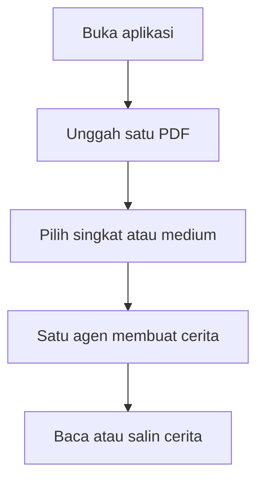
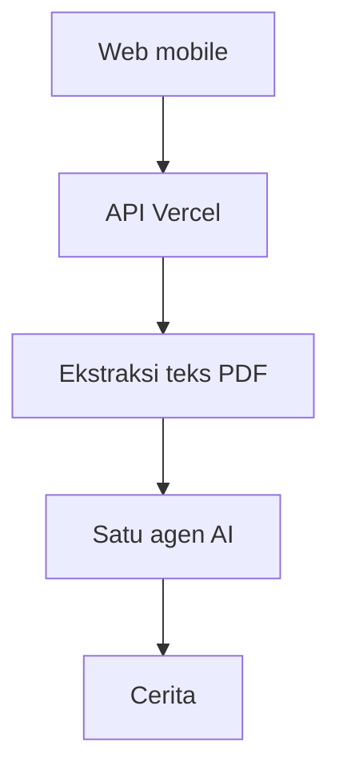

# Product Requirements Document (PRD)

## CeritaBelajar PDF

**Web mobile untuk mengubah materi PDF menjadi cerita edukatif singkat atau medium menggunakan satu agen AI**

| Atribut | Keterangan |
|---|---|
| Versi | 2.0 - Simplified MVP |
| Target pengerjaan | 2 jam |
| Platform | Web responsif dan mobile-first |
| Deployment | Vercel |
| Arsitektur | Satu agen AI (*mono-agent architecture*) |
| Pengguna | Siswa |
| Sumber materi | Hanya PDF yang diunggah pengguna |

---

## 1. Ringkasan Produk

CeritaBelajar PDF adalah aplikasi web sederhana yang membantu siswa memahami materi dalam dokumen PDF melalui cerita edukatif. Siswa cukup mengunggah satu file PDF, memilih panjang cerita, lalu sistem mengubah isi dokumen tersebut menjadi cerita yang lebih mudah dibaca.

Produk hanya mempunyai satu fungsi utama:

> **Unggah PDF - pilih panjang - buat cerita - baca hasilnya.**

Sistem menggunakan satu agen AI untuk membaca teks hasil ekstraksi PDF dan mengubahnya menjadi cerita. Agen tidak mencari informasi dari internet dan tidak menggunakan sumber lain di luar file yang diunggah siswa.

---

## 2. Dasar Pengembangan dari Skripsi

PRD ini disusun hanya berdasarkan gagasan yang terdapat dalam PDF skripsi yang diunggah. Bagian teori yang digunakan sebagai dasar produk adalah pembelajaran berbasis cerita, penggunaan LLM untuk menghasilkan teks, dan penyesuaian narasi dengan kebutuhan pembelajar.

### 2.1 Pembelajaran berbasis cerita

Pembelajaran berbasis cerita menggunakan narasi sebagai konteks untuk menghubungkan materi dengan pengalaman pembelajar. Cerita dapat membuat materi yang abstrak menjadi lebih konkret, dekat, dan mudah diikuti (Mawasi et al., 2021; Zarifsanaiey et al., 2022).

### 2.2 Penyesuaian terhadap siswa

Cerita edukatif perlu memperhatikan tingkat kesulitan kosakata, panjang kalimat, beban informasi, dan kebutuhan pembaca. Penyesuaian tersebut membantu siswa memahami materi secara bertahap tanpa menghadapi teks yang terlalu padat (Yue et al., 2022).

### 2.3 Pemanfaatan LLM

LLM dapat digunakan untuk mengolah teks menjadi bentuk narasi yang lebih alami. Dalam MVP ini, kemampuan tersebut disederhanakan menjadi satu agen yang menerima teks PDF dan menghasilkan satu cerita edukatif.

### 2.4 Batas penerapan teori

Produk ini tidak mereplikasi seluruh sistem yang dikembangkan dalam skripsi. Produk hanya mengambil gagasan paling sederhana dan relevan untuk siswa, yaitu mengubah materi pembelajaran menjadi cerita melalui bantuan AI.

---

## 3. Masalah Pengguna

Siswa sering menerima materi dalam bentuk PDF yang:

- panjang dan padat;
- menggunakan bahasa akademik;
- berisi banyak penjelasan dalam satu halaman;
- sulit dipahami melalui satu kali pembacaan;
- kurang menarik apabila hanya dibaca sebagai teks informatif.

Masalah utamanya dirumuskan sebagai berikut:

> Siswa membutuhkan cara yang lebih sederhana dan menarik untuk memahami isi PDF tanpa harus membaca seluruh dokumen dalam bentuk aslinya.

---

## 4. Solusi Produk

CeritaBelajar PDF mengubah isi dokumen menjadi cerita edukatif dengan alur sederhana.

Siswa melakukan empat langkah:

1. Mengunggah satu file PDF.
2. Menentukan fokus cerita apabila diperlukan.
3. Memilih cerita singkat atau medium.
4. Menekan tombol “Buat Cerita”.

Sistem kemudian:

1. mengambil teks dari PDF;
2. mengirim teks kepada satu agen AI;
3. meminta agen menyusun cerita berdasarkan isi dokumen;
4. menampilkan cerita kepada siswa.

Tidak ada pencarian web, sumber tambahan, sistem banyak agen, atau pengolahan data yang kompleks.

---

## 5. Sasaran Pengguna

### Pengguna utama

Siswa SMP dan SMA yang belajar menggunakan materi berbentuk PDF melalui telepon seluler atau laptop.

### Kebutuhan pengguna

- memahami materi PDF dengan bahasa yang lebih ringan;
- memperoleh versi cerita yang tidak terlalu panjang;
- menggunakan aplikasi tanpa membuat akun;
- membaca hasil dengan nyaman melalui telepon seluler;
- menyalin cerita untuk dipelajari kembali.

### *Jobs to be done*

> Ketika materi PDF terasa panjang atau sulit dipahami, saya ingin mengubah isinya menjadi cerita agar saya lebih mudah menangkap ide utamanya.

---

## 6. Tujuan MVP

- Menyediakan alur penggunaan yang selesai dalam satu halaman.
- Menerima satu file PDF sebagai satu-satunya sumber.
- Menghasilkan pilihan cerita singkat atau medium.
- Menampilkan hasil yang nyaman dibaca pada layar mobile.
- Dapat dikembangkan dan dipasang di Vercel dalam waktu sekitar dua jam.

---

## 7. Batasan MVP

MVP tidak mencakup:

- akun dan autentikasi pengguna;
- penyimpanan riwayat;
- pencarian internet;
- sumber di luar PDF;
- lebih dari satu agen;
- gambar atau ilustrasi otomatis;
- kuis;
- suara atau pembacaan teks;
- unggah lebih dari satu PDF;
- dashboard guru;
- analitik penggunaan;
- pemrosesan PDF hasil pindai yang tidak memiliki lapisan teks.

---

## 8. Fitur Utama

| ID | Fitur | Deskripsi |
|---|---|---|
| F-01 | Unggah PDF | Siswa mengunggah satu file berformat PDF |
| F-02 | Fokus cerita | Siswa dapat menulis bagian atau topik yang ingin dijadikan cerita |
| F-03 | Pilihan panjang | Siswa memilih cerita singkat atau medium |
| F-04 | Buat cerita | Satu agen mengolah teks PDF menjadi cerita |
| F-05 | Tampilan hasil | Cerita ditampilkan dalam format yang nyaman dibaca |
| F-06 | Salin cerita | Siswa dapat menyalin seluruh hasil |
| F-07 | Buat ulang | Siswa dapat menghasilkan versi cerita lain dari PDF yang sama |
| F-08 | Mulai kembali | Siswa dapat menghapus sesi dan mengunggah PDF baru |

---

## 9. Pilihan Panjang Cerita

### Cerita singkat

- sekitar 250-350 kata;
- waktu baca sekitar 2-3 menit;
- satu tokoh utama;
- satu masalah;
- satu penyelesaian;
- cocok untuk mendapatkan gambaran dasar materi.

### Cerita medium

- sekitar 400-600 kata;
- waktu baca sekitar 4-5 menit;
- maksimal tiga tokoh;
- penjelasan konsep lebih lengkap;
- cocok untuk mempelajari materi dengan konteks yang lebih luas.

Pilihan cerita panjang tidak tersedia dalam MVP.

---

## 10. Alur Pengguna



### Skenario penggunaan

1. Siswa membuka aplikasi melalui telepon seluler.
2. Siswa mengunggah file `materi-siklus-air.pdf`.
3. Sistem menampilkan nama dan ukuran file.
4. Siswa memilih “Cerita singkat”.
5. Siswa menekan tombol “Buat Cerita”.
6. Sistem menampilkan status “Membaca PDF” dan “Menyusun cerita”.
7. Cerita ditampilkan.
8. Siswa membaca atau menyalin hasil.

---

## 11. Spesifikasi Antarmuka

### 11.1 Halaman utama

Seluruh proses ditempatkan dalam satu halaman agar sederhana.

Urutan komponen:

1. nama aplikasi;
2. deskripsi satu kalimat;
3. area unggah PDF;
4. kolom fokus cerita;
5. pilihan singkat atau medium;
6. tombol “Buat Cerita”;
7. indikator proses;
8. hasil cerita;
9. tombol salin, buat ulang, dan mulai kembali.

### 11.2 Teks utama

**Judul halaman:**

> Ubah PDF menjadi cerita yang lebih mudah dipahami

**Subjudul:**

> Unggah materi, pilih panjang cerita, lalu mulai membaca.

**Label unggah:**

> Pilih satu file PDF

**Kolom fokus:**

> Bagian apa yang ingin kamu jadikan cerita? (opsional)

**Tombol utama:**

> Buat Cerita

### 11.3 Prinsip tampilan

- *mobile-first*;
- satu kolom;
- ukuran teks isi minimal 17 piksel;
- tombol utama mudah dijangkau;
- warna tenang dan ramah siswa;
- tidak menggunakan terlalu banyak menu;
- hasil ditampilkan dalam kartu putih;
- lebar isi maksimal 720 piksel pada desktop.

---

## 12. Persyaratan Fungsional

### FR-01: Unggah PDF

Sistem harus menerima satu file PDF.

**Kriteria penerimaan:**

- hanya format `.pdf` yang diterima;
- ukuran maksimum file 10 MB;
- nama dan ukuran file ditampilkan;
- file dapat diganti sebelum proses dimulai;
- file selain PDF ditolak dengan pesan yang jelas.

### FR-02: Ekstraksi teks

Sistem harus mengambil teks dari PDF sebelum memanggil agen.

**Kriteria penerimaan:**

- teks dapat diekstrak dari PDF berbasis teks;
- apabila tidak ada teks yang terbaca, sistem menampilkan pesan untuk menggunakan PDF lain;
- sistem tidak mengambil materi dari internet;
- teks PDF menjadi satu-satunya konteks untuk agen.

### FR-03: Fokus cerita

Sistem menyediakan satu kolom fokus yang bersifat opsional.

**Kriteria penerimaan:**

- panjang maksimum 150 karakter;
- fokus digunakan untuk memilih bagian isi yang paling relevan;
- bila kosong, agen merangkum gagasan utama PDF dalam bentuk cerita.

### FR-04: Panjang cerita

Sistem menyediakan dua pilihan:

- singkat;
- medium.

**Kriteria penerimaan:**

- “Singkat” menjadi pilihan default;
- hanya satu pilihan yang dapat aktif;
- pilihan dikirim bersama teks PDF kepada agen.

### FR-05: Pembuatan cerita

Sistem menggunakan satu agen untuk membuat cerita.

**Kriteria penerimaan:**

- agen menerima teks PDF, fokus, dan pilihan panjang;
- agen tidak menggunakan hasil pencarian web;
- hasil berbentuk judul dan isi cerita;
- tombol tidak dapat ditekan berulang selama proses berlangsung;
- kegagalan API menampilkan pesan dan tombol coba lagi.

### FR-06: Hasil cerita

Sistem menampilkan:

- nama PDF sumber;
- panjang yang dipilih;
- judul cerita;
- isi cerita;
- tombol salin;
- tombol buat ulang;
- tombol mulai kembali.

---

## 13. Aturan Agen Tunggal

Agen tunggal mempunyai satu tugas:

> Mengubah teks dari PDF menjadi cerita edukatif yang mudah dipahami siswa.

Agen harus mengikuti aturan:

1. Hanya menggunakan informasi dari teks PDF.
2. Tidak melakukan pencarian web.
3. Tidak menambahkan tokoh nyata, angka, tempat, atau peristiwa yang tidak terdapat dalam PDF.
4. Boleh membuat tokoh fiktif sederhana untuk menyampaikan materi.
5. Menggunakan bahasa Indonesia yang jelas.
6. Menghindari istilah sulit atau menjelaskannya dalam kalimat sederhana.
7. Mengikuti panjang cerita yang dipilih.
8. Memusatkan cerita pada fokus yang ditulis siswa.
9. Jika isi PDF tidak cukup, agen menyatakan bahwa materi tidak memadai untuk dibuat menjadi cerita.

### Contoh instruksi sistem

```text
Anda adalah satu agen pembuat cerita edukatif untuk siswa.

Gunakan hanya informasi di dalam PDF_SOURCE.
Jangan mencari atau menambahkan informasi dari luar PDF_SOURCE.

Tugas:
1. Pahami gagasan utama teks.
2. Perhatikan FOKUS jika diberikan.
3. Buat cerita edukatif berbahasa Indonesia.
4. Gunakan panjang sesuai STORY_LENGTH.
5. Kembalikan judul dan isi cerita.

PDF_SOURCE:
{{pdf_text}}

FOKUS:
{{focus}}

STORY_LENGTH:
{{short_or_medium}}
```

---

## 14. Arsitektur Mono-Agent



### Penjelasan

- **Web mobile:** menerima PDF dan pilihan siswa.
- **API Vercel:** mengatur proses unggah dan permintaan.
- **Ekstraksi teks:** mengambil teks yang dapat dibaca dari PDF.
- **Satu agen AI:** menyusun cerita dari teks tersebut.
- **Cerita:** dikirim kembali dan ditampilkan pada halaman yang sama.

Tidak ada pembagian peran agen. Seluruh proses penulisan ditangani oleh satu permintaan AI.

---

## 15. Arsitektur Teknis

### Teknologi

- Next.js;
- TypeScript;
- Tailwind CSS;
- Vercel;
- pustaka pembaca PDF berbasis JavaScript;
- satu API route;
- satu layanan LLM.

### Struktur proyek

```text
app/
  page.tsx
  api/
    generate/
      route.ts
components/
  PdfUploader.tsx
  LengthSelector.tsx
  StoryResult.tsx
lib/
  extractPdfText.ts
  generateStory.ts
types/
  story.ts
```

### Endpoint

`POST /api/generate`

**Input:**

```json
{
  "pdfText": "teks hasil ekstraksi",
  "focus": "topik opsional",
  "length": "short"
}
```

**Output:**

```json
{
  "title": "Judul cerita",
  "story": "Isi cerita",
  "sourceFile": "nama-file.pdf",
  "length": "short"
}
```

---

## 16. Persyaratan Nonfungsional

| Aspek | Ketentuan |
|---|---|
| Responsif | Dapat digunakan mulai layar 360 piksel |
| Privasi | PDF tidak disimpan setelah sesi selesai |
| Keamanan | Kunci API hanya berada pada environment variable |
| Format | Hanya menerima PDF |
| Keterbacaan | Paragraf pendek dan teks minimal 17 piksel |
| Keadaan gagal | Pesan kesalahan harus mudah dipahami siswa |
| Kompatibilitas | Chrome mobile dan desktop terkini |

---

## 17. Penanganan PDF

### PDF yang dapat diproses

- PDF yang mempunyai teks;
- modul atau materi sekolah;
- artikel atau bacaan pembelajaran;
- ukuran maksimal 10 MB.

### PDF yang tidak dapat diproses dalam MVP

- PDF hasil foto atau pindai tanpa teks;
- PDF terkunci;
- PDF rusak;
- PDF berisi gambar tanpa keterangan teks.

Untuk PDF yang sangat panjang, sistem dapat membatasi jumlah karakter yang dikirim kepada agen. Siswa sebaiknya menggunakan kolom fokus agar bagian yang diproses lebih terarah.

---

## 18. Rencana Pengerjaan Dua Jam

| Waktu | Pekerjaan | Hasil |
|---|---|---|
| 00-15 menit | Membuat proyek Next.js dan Tailwind | Proyek berjalan |
| 15-35 menit | Membuat area unggah dan pilihan panjang | Formulir selesai |
| 35-60 menit | Menambahkan ekstraksi teks PDF | Teks PDF terbaca |
| 60-90 menit | Membuat API satu agen | Cerita dapat dihasilkan |
| 90-105 menit | Membuat tampilan hasil dan tombol salin | Alur selesai |
| 105-115 menit | Memeriksa mobile dan pesan kesalahan | Tampilan stabil |
| 115-120 menit | Deploy ke Vercel | URL aktif |

---

## 19. Definisi Selesai

MVP dinyatakan selesai jika:

- siswa dapat mengunggah satu PDF;
- sistem dapat membaca teks PDF;
- pilihan singkat dan medium berfungsi;
- satu agen dapat menghasilkan cerita;
- hasil dapat dibaca dan disalin;
- tidak ada sumber selain PDF yang digunakan;
- tampilan berfungsi pada telepon seluler;
- aplikasi berhasil dipasang di Vercel.

---

## 20. Risiko dan Mitigasi

| Risiko | Mitigasi |
|---|---|
| PDF tidak memiliki teks | Tampilkan pesan untuk menggunakan PDF berbasis teks |
| PDF terlalu besar | Batasi ukuran dan jumlah teks yang diproses |
| Proses API gagal | Tampilkan tombol “Coba Lagi” |
| Hasil terlalu panjang | Terapkan batas kata pada instruksi agen |
| Agen menambahkan isi di luar PDF | Gunakan instruksi sumber tunggal dan tampilkan peringatan agar siswa tetap memeriksa PDF asli |
| Pemrosesan lambat | Tampilkan indikator “Membaca PDF” dan “Menyusun cerita” |

---

## 21. Batas Klaim Akademik

CeritaBelajar PDF merupakan prototipe fungsional yang menerapkan gagasan pembelajaran berbasis cerita dari skripsi. Produk ini belum dapat dinyatakan meningkatkan hasil belajar siswa sebelum dilakukan validasi materi, uji kegunaan, dan pengujian pembelajaran pada pengguna sebenarnya.

Pada tahap MVP, klaim yang tepat adalah:

> Aplikasi mampu mengubah teks dari satu PDF menjadi cerita edukatif singkat atau medium melalui satu agen AI.

---

## 22. Ringkasan Akhir

CeritaBelajar PDF dirancang sebagai produk yang sangat sederhana dan realistis dikerjakan dalam dua jam. Siswa hanya perlu mengunggah PDF, memilih cerita singkat atau medium, lalu membaca hasil yang dibuat oleh satu agen AI. Seluruh materi berasal dari PDF yang diunggah, sedangkan fitur tambahan dan arsitektur kompleks tidak dimasukkan ke dalam MVP.

