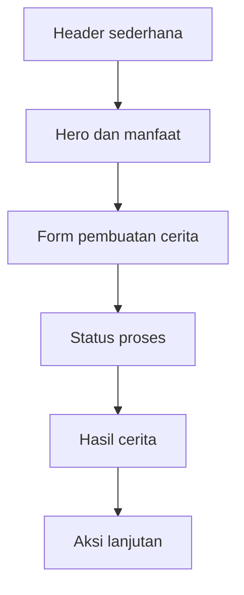
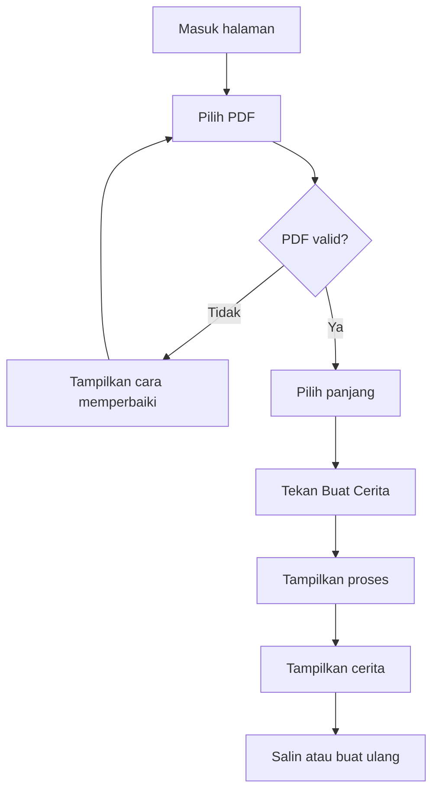

# PRD UI/UX

## CeritaBelajar PDF

**Antarmuka mobile-first untuk mengubah satu PDF menjadi cerita edukatif singkat atau medium**

| Atribut | Keterangan |
|---|---|
| Versi | 1.0 |
| Status | Siap untuk desain dan implementasi MVP |
| Produk induk | CeritaBelajar PDF |
| Platform | Web responsif |
| Deployment | Vercel |
| Pengguna utama | Siswa SMP dan SMA |
| Arsitektur produk | Satu agen AI |
| Sumber materi | Hanya PDF yang diunggah siswa |
| Target implementasi | Sekitar 2 jam |

---

## 1. Ringkasan UI/UX

CeritaBelajar PDF menggunakan antarmuka satu halaman. Siswa tidak perlu membuat akun, membuka dashboard, atau mempelajari banyak menu. Seluruh pengalaman disusun dalam urutan vertikal:

1. memahami manfaat aplikasi;
2. mengunggah satu PDF;
3. menuliskan fokus cerita jika diperlukan;
4. memilih cerita singkat atau medium;
5. membuat cerita;
6. membaca dan menyalin hasil.

Desain mengikuti prinsip *progressive disclosure*. Pada kondisi awal, siswa hanya melihat elemen yang diperlukan untuk memulai. Informasi hasil baru ditampilkan setelah cerita selesai dibuat.

---

## 2. Tujuan Desain

UI/UX harus:

- mudah dipahami dalam lima detik pertama;
- memungkinkan siswa membuat cerita tanpa panduan tambahan;
- mengutamakan penggunaan melalui telepon seluler;
- mempertahankan satu tindakan utama pada setiap keadaan layar;
- menampilkan proses secara jelas tanpa istilah teknis;
- menyediakan pengalaman membaca yang nyaman;
- memberi pesan kesalahan yang menjelaskan masalah dan tindakan berikutnya;
- tidak menampilkan menu atau data yang tidak diperlukan siswa.

---

## 3. Masalah UX

### 3.1 Beban materi

PDF pembelajaran sering mempunyai teks panjang, susunan formal, dan kepadatan informasi tinggi. Antarmuka tidak boleh menambah beban tersebut dengan terlalu banyak kontrol.

### 3.2 Ketidakjelasan proses AI

Siswa dapat mengira aplikasi berhenti bekerja ketika pembuatan cerita membutuhkan waktu. Oleh karena itu, sistem perlu menampilkan status proses yang sederhana.

### 3.3 Risiko kesalahan unggah

Pengguna dapat memilih file bukan PDF, file terlalu besar, atau PDF yang tidak mempunyai teks. Kesalahan harus disampaikan di dekat area unggah.

### 3.4 Kenyamanan membaca

Cerita medium dapat mencapai 600 kata. Tampilan harus menjaga ukuran teks, jarak baris, panjang baris, dan pemisahan paragraf agar nyaman dibaca pada layar kecil.

---

## 4. Persona UX

### Persona utama

**Nama:** Raka  
**Usia:** 14-17 tahun  
**Perangkat:** telepon seluler  
**Konteks:** menerima materi PDF dari guru  
**Tujuan:** memahami gagasan materi melalui cerita yang lebih ringan  
**Kebiasaan:** membaca cepat, mudah meninggalkan halaman yang terlihat rumit  
**Hambatan:** tidak memahami istilah teknis dan tidak sabar menunggu tanpa informasi proses

### Kebutuhan desain

- instruksi singkat;
- tombol yang terlihat jelas;
- area sentuh yang cukup besar;
- umpan balik langsung;
- paragraf tidak terlalu panjang;
- tidak ada keharusan masuk atau mendaftar.

---

## 5. Prinsip Desain

### 5.1 Satu halaman, satu tujuan

Semua langkah ditempatkan pada satu halaman. Navigasi utama tidak diperlukan.

### 5.2 Bahasa siswa

Gunakan kata “unggah”, “pilih”, “buat”, “baca”, dan “salin”. Hindari istilah seperti *parsing*, *token*, *model*, atau *endpoint* pada antarmuka.

### 5.3 Tindakan utama selalu jelas

Tombol “Buat Cerita” menjadi tindakan primer sebelum proses. Setelah hasil tersedia, tindakan primer berubah menjadi “Salin Cerita”.

### 5.4 Keadaan sistem terlihat

Sistem harus memberi tahu apakah:

- belum ada PDF;
- PDF sudah dipilih;
- PDF sedang dibaca;
- cerita sedang dibuat;
- cerita berhasil dibuat;
- proses gagal.

### 5.5 Membaca sebagai fokus akhir

Setelah cerita selesai, halaman mengarahkan perhatian ke hasil. Elemen formulir menjadi lebih ringkas dan cerita menjadi pusat tampilan.

### 5.6 Aksesibilitas sejak awal

Kontras, ukuran teks, label, fokus keyboard, dan pesan status harus dirancang sejak versi MVP.

---

## 6. Arsitektur Informasi



### Hierarki halaman

| Urutan | Bagian | Tujuan |
|---|---|---|
| 1 | Header | Identitas produk |
| 2 | Hero | Menjelaskan manfaat utama |
| 3 | Area unggah | Memilih satu PDF |
| 4 | Fokus cerita | Mengarahkan bagian materi |
| 5 | Panjang cerita | Memilih singkat atau medium |
| 6 | Tombol utama | Memulai proses |
| 7 | Status | Menjelaskan proses berlangsung |
| 8 | Hasil | Menampilkan cerita |
| 9 | Aksi hasil | Menyalin, membuat ulang, atau memulai kembali |
| 10 | Catatan | Mengingatkan siswa untuk tetap merujuk PDF asli |

---

## 7. Alur Pengguna Utama



### Jalur tercepat

1. Buka aplikasi.
2. Unggah PDF.
3. Biarkan pilihan “Singkat” sebagai default.
4. Tekan “Buat Cerita”.
5. Baca hasil.

Kolom fokus tidak wajib diisi sehingga pengguna dapat menyelesaikan tugas dengan tiga tindakan utama.

---

## 8. Model Keadaan Halaman

| Keadaan | Kondisi | Elemen utama |
|---|---|---|
| Empty | Belum ada PDF | Area unggah dan instruksi |
| File selected | PDF valid sudah dipilih | Kartu file, pilihan panjang, tombol aktif |
| Loading | Sistem sedang bekerja | Indikator proses dan tombol nonaktif |
| Success | Cerita selesai | Kartu cerita dan tombol tindakan |
| Upload error | File tidak valid | Pesan kesalahan di area unggah |
| Processing error | Proses gagal | Pesan kesalahan dan tombol coba lagi |

---

## 9. Spesifikasi Layar: Empty State

### 9.1 Header

**Isi:**

- ikon buku sederhana;
- nama “CeritaBelajar PDF”.

**Ketentuan:**

- tinggi mobile: 64 piksel;
- tidak menggunakan menu navigasi;
- logo dapat ditekan untuk kembali ke kondisi awal;
- garis bawah header tidak wajib.

### 9.2 Hero

**Judul:**

> Ubah PDF menjadi cerita yang lebih mudah dipahami

**Subjudul:**

> Unggah materi, pilih panjang cerita, lalu mulai membaca.

**Ketentuan visual:**

- judul maksimal tiga baris pada layar 360 piksel;
- rata tengah pada mobile;
- rata kiri pada desktop;
- tidak menggunakan ilustrasi besar agar proses awal tetap ringan.

### 9.3 Kartu formulir

Kartu formulir menjadi pusat perhatian.

**Isi:**

1. area unggah;
2. kolom fokus;
3. pilihan panjang;
4. tombol “Buat Cerita”.

**Ketentuan:**

- latar putih;
- sudut membulat 20 piksel;
- padding 20 piksel pada mobile;
- jarak antarkomponen 20-24 piksel;
- bayangan sangat lembut.

---

## 10. Komponen Area Unggah

### 10.1 Kondisi default

**Teks utama:**

> Pilih satu file PDF

**Teks bantuan:**

> Maksimal 10 MB. Gunakan PDF yang teksnya dapat diseleksi.

**Tombol:**

> Pilih PDF

### 10.2 Perilaku

- seluruh area dapat ditekan;
- pada desktop mendukung *drag and drop*;
- pada mobile membuka pemilih file;
- menerima hanya `.pdf`;
- setelah file dipilih, area berubah menjadi kartu file;
- pemilihan file yang sama tetap diperbolehkan setelah pengguna menekan “Mulai Lagi”.

### 10.3 Tampilan kartu file

**Isi:**

- ikon PDF;
- nama file maksimal dua baris;
- ukuran file;
- tombol ikon “Ganti” atau “Hapus”.

**Contoh:**

> materi-sistem-tata-surya.pdf  
> 2,4 MB

### 10.4 Keadaan visual

| Keadaan | Tampilan |
|---|---|
| Default | Border putus-putus abu-abu |
| Hover desktop | Border dan latar menjadi indigo muda |
| Focus | Cincin fokus 2 piksel |
| Drag active | Border solid indigo dan ikon bergerak ringan |
| File selected | Border solid abu-abu dan kartu file |
| Error | Border merah dan pesan di bawah area |
| Disabled | Opacity 60%, tidak dapat ditekan |

---

## 11. Komponen Fokus Cerita

### Label

> Fokus cerita

### Teks bantuan

> Opsional. Tulis bagian yang paling ingin kamu pahami.

### Placeholder

> Contoh: proses terjadinya hujan

### Ketentuan

- menggunakan input satu baris;
- maksimum 150 karakter;
- penghitung karakter baru muncul setelah 120 karakter;
- tidak wajib;
- tidak boleh menutupi tombol utama ketika keyboard mobile terbuka.

### Pesan batas karakter

> Fokus maksimal 150 karakter.

---

## 12. Komponen Pilihan Panjang

Gunakan dua kartu pilihan atau *segmented control*.

### Pilihan 1

**Judul:** Singkat  
**Deskripsi:** 2-3 menit membaca  
**Status awal:** aktif

### Pilihan 2

**Judul:** Medium  
**Deskripsi:** 4-5 menit membaca

### Ketentuan interaksi

- hanya satu pilihan aktif;
- seluruh area kartu dapat ditekan;
- pilihan aktif menggunakan border indigo dan ikon centang;
- perubahan pilihan tidak menghapus PDF atau fokus;
- kontrol dapat digunakan dengan tombol panah pada keyboard.

---

## 13. Tombol Utama

### Label

> Buat Cerita

### Kondisi

| Kondisi | Label/Perilaku |
|---|---|
| Belum ada PDF | Nonaktif |
| PDF valid | Aktif |
| Loading | “Sedang membuat...” dan nonaktif |
| Error | Aktif kembali |

### Ketentuan visual

- tinggi minimal 48 piksel;
- lebar penuh pada mobile;
- warna indigo;
- teks putih;
- radius 12 piksel;
- indikator spinner kecil ketika loading;
- tidak menggunakan animasi berlebihan.

---

## 14. Spesifikasi Loading State

Ketika proses dimulai:

- formulir tetap terlihat tetapi tidak dapat diubah;
- tombol utama berubah menjadi keadaan loading;
- kartu status muncul di bawah tombol;
- halaman tidak berpindah;
- pembaca layar menerima pembaruan melalui `aria-live="polite"`.

### Urutan pesan

1. **Membaca PDF...**
2. **Menemukan bagian penting...**
3. **Menyusun cerita...**

Pesan ditampilkan bergantian. Jangan menggunakan persentase karena sistem tidak dapat menjanjikan kemajuan yang presisi.

### Visual loading

- spinner atau tiga titik bergerak;
- ikon dokumen;
- latar indigo sangat muda;
- teks utama satu baris;
- teks bantuan:

> Proses ini mungkin memerlukan beberapa saat.

### Durasi lama

Jika proses melebihi 20 detik, tampilkan:

> Ceritanya masih disusun. Mohon tetap di halaman ini.

---

## 15. Spesifikasi Success State

Setelah hasil diterima:

- sistem menggulir halaman secara halus menuju judul hasil;
- fokus keyboard dipindahkan ke judul hasil;
- kartu hasil muncul di bawah formulir;
- formulir dapat diringkas tetapi tidak dihilangkan;
- nama PDF sumber tetap terlihat.

### Struktur kartu hasil

1. label “Cerita dari PDF”;
2. judul cerita;
3. metadata;
4. isi cerita;
5. catatan sumber;
6. tombol tindakan.

### Metadata

Contoh:

> Sumber: materi-siklus-air.pdf · Cerita singkat · 3 menit membaca

### Isi cerita

- ukuran teks mobile: 17 piksel;
- ukuran desktop: 18 piksel;
- tinggi baris: 1,7;
- jarak antarparagraf: 16 piksel;
- lebar teks maksimum: 68 karakter;
- tidak menggunakan paragraf rata kanan-kiri;
- judul cerita menggunakan H2.

### Catatan sumber

> Cerita ini dibuat hanya dari isi PDF yang kamu unggah. Tetap gunakan PDF asli sebagai bahan belajar utama.

---

## 16. Tombol pada Hasil

### Tombol primer

**Label:** Salin Cerita

Setelah berhasil:

> Cerita disalin

Gunakan toast singkat selama 3 detik.

### Tombol sekunder

**Label:** Buat Versi Lain

Perilaku:

- menggunakan PDF, fokus, dan pilihan panjang yang sama;
- tidak meminta siswa mengunggah ulang;
- hasil lama tetap terlihat sampai hasil baru selesai.

### Tombol tersier

**Label:** Mulai Lagi

Perilaku:

- menghapus file dari sesi;
- membersihkan fokus dan hasil;
- mengembalikan pilihan panjang ke “Singkat”;
- menggulir halaman ke area unggah.

Jika hasil belum disalin, tampilkan konfirmasi sederhana:

> Mulai dari awal? Cerita saat ini akan dihapus dari halaman.

---

## 17. Error States dan Microcopy

### 17.1 Format tidak sesuai

**Judul:**

> File belum dapat digunakan

**Pesan:**

> Pilih file dengan format PDF.

### 17.2 File terlalu besar

**Pesan:**

> Ukuran PDF melebihi 10 MB. Gunakan file yang lebih kecil.

### 17.3 PDF tidak memiliki teks

**Judul:**

> Teks PDF tidak terbaca

**Pesan:**

> Gunakan PDF yang teksnya dapat dipilih, bukan hasil foto atau pindai.

### 17.4 PDF rusak atau terkunci

**Pesan:**

> PDF tidak dapat dibuka. Periksa file atau gunakan PDF lain.

### 17.5 Proses gagal

**Judul:**

> Cerita belum berhasil dibuat

**Pesan:**

> Coba lagi beberapa saat. PDF kamu masih tersedia di halaman ini.

**Tombol:**

> Coba Lagi

### 17.6 Koneksi terputus

**Pesan:**

> Koneksi internet terputus. Sambungkan kembali lalu coba lagi.

### Prinsip pesan kesalahan

- tidak menyalahkan siswa;
- menjelaskan penyebab dalam bahasa sederhana;
- selalu memberi langkah perbaikan;
- diletakkan dekat komponen terkait;
- disertai ikon, tetapi makna tidak bergantung pada warna atau ikon saja.

---

## 18. Wireframe Struktural Mobile

| Posisi | Blok | Tinggi/perilaku |
|---|---|---|
| Atas | Header | 64 px, tetap sederhana |
| 1 | Hero | Judul dan subjudul |
| 2 | Kartu formulir | Lebar penuh dikurangi margin 16 px |
| 2a | Upload | Minimal 148 px |
| 2b | Fokus | Input 48 px |
| 2c | Panjang | Dua pilihan sejajar |
| 2d | CTA | Tombol 48 px |
| 3 | Status | Muncul hanya saat loading |
| 4 | Hasil | Muncul setelah berhasil |
| 5 | Catatan | Teks kecil dan footer |

### Urutan fokus keyboard

1. logo;
2. area unggah;
3. tombol ganti/hapus file;
4. input fokus;
5. pilihan singkat;
6. pilihan medium;
7. tombol buat cerita;
8. tombol salin;
9. tombol versi lain;
10. tombol mulai lagi.

---

## 19. Tata Letak Responsif

### Mobile: 360-767 piksel

- satu kolom;
- margin halaman 16 piksel;
- hero rata tengah;
- kartu formulir lebar penuh;
- tombol hasil ditumpuk vertikal;
- pilihan panjang tetap dua kolom apabila muat;
- hasil tidak menggunakan panel samping.

### Tablet: 768-1023 piksel

- margin halaman 32 piksel;
- lebar konten maksimum 720 piksel;
- hero dan formulir tetap satu kolom;
- tombol hasil dapat ditampilkan sejajar.

### Desktop: 1024 piksel ke atas

- lebar halaman maksimum 1120 piksel;
- pada keadaan awal, hero dan kartu formulir dapat menggunakan komposisi dua kolom;
- setelah hasil tersedia, cerita ditempatkan di tengah dengan lebar maksimum 760 piksel;
- tidak membuat sidebar.

### Frame desain yang disarankan

- Mobile: 390 × 844 piksel.
- Tablet: 768 × 1024 piksel.
- Desktop: 1440 × 1024 piksel.

---

## 20. Design System Ringkas

### 20.1 Warna

| Token | Nilai | Penggunaan |
|---|---|---|
| Primary 600 | `#4F46E5` | Tombol utama dan pilihan aktif |
| Primary 50 | `#EEF2FF` | Latar status dan sorotan |
| Accent 500 | `#14B8A6` | Indikator keberhasilan ringan |
| Background | `#F8FAFC` | Latar halaman |
| Surface | `#FFFFFF` | Kartu |
| Text primary | `#0F172A` | Judul dan isi |
| Text secondary | `#475569` | Teks bantuan |
| Border | `#CBD5E1` | Garis komponen |
| Error | `#DC2626` | Pesan kesalahan |
| Error background | `#FEF2F2` | Latar kesalahan |

Semua kombinasi warna teks dan latar harus memenuhi kontras WCAG AA.

### 20.2 Tipografi

Gunakan **Inter**, **Plus Jakarta Sans**, atau font sistem sans-serif.

| Gaya | Mobile | Desktop | Berat |
|---|---:|---:|---:|
| Display | 32 px / 1,2 | 48 px / 1,15 | 700 |
| H2 | 26 px / 1,3 | 34 px / 1,25 | 700 |
| H3 | 20 px / 1,4 | 22 px / 1,4 | 600 |
| Body | 17 px / 1,7 | 18 px / 1,7 | 400 |
| UI text | 15-16 px / 1,5 | 15-16 px / 1,5 | 500 |
| Caption | 13-14 px / 1,5 | 13-14 px / 1,5 | 400 |

### 20.3 Spacing

Gunakan sistem kelipatan 4:

- 4 px;
- 8 px;
- 12 px;
- 16 px;
- 20 px;
- 24 px;
- 32 px;
- 48 px;
- 64 px.

### 20.4 Radius

- input dan tombol: 12 piksel;
- kartu kecil: 16 piksel;
- kartu utama: 20 piksel;
- pill/status: 999 piksel.

### 20.5 Bayangan

Gunakan satu bayangan lembut:

```css
box-shadow: 0 12px 32px rgba(15, 23, 42, 0.08);
```

---

## 21. Ikonografi

Gunakan ikon garis sederhana dan konsisten.

Ikon yang diperlukan:

- buku/logo;
- unggah;
- file PDF;
- ganti;
- hapus;
- centang;
- spinner;
- salin;
- ulangi;
- peringatan.

Ketentuan:

- ukuran umum 20-24 piksel;
- ikon tombol harus mempunyai label aksesibel;
- jangan menggunakan emoji sebagai ikon utama;
- gunakan satu pustaka ikon agar gaya konsisten.

---

## 22. Animasi dan Transisi

Animasi hanya membantu memahami perubahan keadaan.

### Animasi yang digunakan

- perubahan border saat file diseret;
- spinner ketika proses;
- hasil masuk dengan *fade* 150-200 milidetik;
- *smooth scroll* menuju hasil;
- toast salin.

### Batasan

- tidak menggunakan animasi latar;
- tidak menggunakan parallax;
- tidak menggunakan ilustrasi bergerak;
- hormati `prefers-reduced-motion`;
- hindari animasi lebih dari 300 milidetik.

---

## 23. Persyaratan Aksesibilitas

- Semua input memiliki label yang terlihat.
- Seluruh fungsi dapat digunakan dengan keyboard.
- Fokus keyboard tidak boleh hilang.
- Indikator fokus minimal 2 piksel.
- Target sentuh minimal 44 × 44 piksel.
- Pesan proses menggunakan `aria-live="polite"`.
- Pesan error menggunakan `role="alert"`.
- Tombol ikon mempunyai `aria-label`.
- Warna bukan satu-satunya penanda keadaan.
- Isi cerita dapat diperbesar hingga 200% tanpa kehilangan fungsi.
- Tidak ada *horizontal scroll* pada lebar 360 piksel.
- Struktur heading mengikuti urutan H1, H2, dan H3.
- Gunakan elemen HTML semantik.

---

## 24. Privasi dalam Antarmuka

Tampilkan catatan singkat di bawah area unggah:

> PDF digunakan untuk membuat cerita pada sesi ini dan tidak disimpan sebagai riwayat.

Jangan meminta:

- nama;
- email;
- sekolah;
- kelas;
- nomor telepon;
- lokasi;
- data identitas lainnya.

Jangan menampilkan nama file pada URL.

---

## 25. Kriteria Penerimaan UI/UX

### Beranda

- Judul manfaat terlihat tanpa menggulir pada layar 390 × 844 piksel.
- Area unggah dapat dikenali sebagai elemen interaktif.
- Tombol utama nonaktif sebelum PDF valid tersedia.

### Formulir

- Semua label terlihat.
- Pilihan “Singkat” aktif secara default.
- Fokus cerita dapat dikosongkan.
- Pesan error muncul dekat komponen yang bermasalah.

### Loading

- Siswa mengetahui bahwa proses masih berlangsung.
- Formulir tidak dapat berubah selama proses.
- Tidak ada persentase kemajuan palsu.

### Hasil

- Judul cerita menjadi fokus setelah proses selesai.
- Cerita tidak terpotong.
- Paragraf nyaman dibaca pada mobile.
- Tombol salin memberikan umpan balik.
- Siswa dapat membuat versi lain tanpa mengunggah ulang.

### Responsif

- Tidak ada *horizontal scroll* pada 360 piksel.
- Tombol tidak saling berhimpitan.
- Nama file panjang tidak merusak layout.
- Keyboard mobile tidak menutupi input aktif.

---

## 26. Rencana Implementasi UI Dua Jam

| Waktu | Fokus | Hasil |
|---|---|---|
| 00-15 menit | Token warna, font, dan layout dasar | Fondasi visual |
| 15-35 menit | Header, hero, dan kartu unggah | Empty state |
| 35-55 menit | Input fokus, pilihan panjang, dan CTA | Form selesai |
| 55-75 menit | File selected, loading, dan error | Keadaan sistem |
| 75-100 menit | Kartu hasil dan tombol tindakan | Success state |
| 100-112 menit | Responsive mobile dan desktop | Layout stabil |
| 112-120 menit | Aksesibilitas dan pemeriksaan akhir | Siap deploy |

---

## 27. Checklist Handoff Developer

- [ ] Halaman menggunakan satu kolom utama pada mobile.
- [ ] Seluruh microcopy mengikuti dokumen ini.
- [ ] Format dan ukuran PDF divalidasi.
- [ ] Tombol utama mempunyai seluruh keadaan.
- [ ] Loading menampilkan status berurutan.
- [ ] Error mempunyai tindakan perbaikan.
- [ ] Hasil otomatis menjadi fokus.
- [ ] Salin cerita menampilkan toast.
- [ ] Mulai lagi membersihkan sesi.
- [ ] Tidak ada data identitas siswa.
- [ ] Tampilan diuji pada 360, 390, 768, dan 1440 piksel.
- [ ] Navigasi keyboard dan pembaca layar dasar diuji.

---

## 28. Ringkasan Keputusan Desain

CeritaBelajar PDF tidak menggunakan pola chatbot, dashboard, sidebar, atau navigasi bertingkat. Pengalaman berpusat pada satu tugas dan satu halaman. Siswa mengunggah satu PDF, memilih cerita singkat atau medium, lalu membaca hasil dari satu agen AI. Desain menggunakan hierarki sederhana, bahasa yang dekat dengan siswa, keadaan sistem yang terlihat, dan area baca yang nyaman pada mobile.

